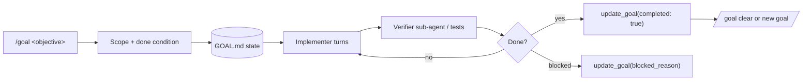

# Goal Engineering

<p align="center">
  
  
</p>

<p align="center">
  <a href="https://cobusgreyling.github.io/goal-engineering/">
    
  </a>
</p>

<p align="center">
  <a href="https://github.com/cobusgreyling/goal-engineering/stargazers"></a>
  <a href="https://github.com/cobusgreyling/goal-engineering/actions/workflows/audit.yml"></a>
  <a href="https://www.npmjs.com/package/@cobusgreyling/goal-audit"></a>
  <a href="https://www.npmjs.com/package/@cobusgreyling/goal-init"></a>
  <a href="https://www.npmjs.com/package/@cobusgreyling/goal-cost"></a>
  <a href="https://www.npmjs.com/package/@cobusgreyling/goal"></a>
  <a href="https://github.com/cobusgreyling/goal-engineering/blob/main/LICENSE"></a>
  <a href="https://cobusgreyling.github.io/goal-engineering/"></a>
</p>

**Goal engineering is replacing one-shot prompts with verifiable, run-until-done objectives.** You define what "done" means, Grok Build works across turns until the condition holds — and reports progress via `/goal` and `update_goal`.

This is the **canonical public reference** for [Grok Build CLI](https://x.ai)'s `/goal` feature.

<p align="center">
  <strong><a href="https://cobusgreyling.github.io/goal-engineering/">→ Interactive showcase + pattern picker</a></strong>
  <br>
  <strong><a href="docs/canonical-essay.md">→ Canonical essay</a></strong> ·
  <strong><a href="examples/golden-path/SESSION.md">→ Golden path (10 min replay)</a></strong>
  <br>
  <strong><a href="https://github.com/cobusgreyling/loop-engineering">→ Companion: Loop Engineering</a></strong> (scheduled cadence) ·
  <strong><a href="https://github.com/cobusgreyling/fleet-engineering">Fleet Engineering</a></strong> (governed populations)
</p>

## The One-Line Definition

A **goal** is a single autonomous objective with a verifiable completion condition. Unlike a loop (which fires on a schedule), a goal **persists across turns** until Grok marks it complete, blocked, or you pause it.

```
Prompt  = one turn, one answer
Loop    = recurring discovery + triage on a cadence
Goal    = run until done (or blocked / paused)
```

## Quick Start (2 minutes)

```bash
# Unified CLI (recommended)
npx @cobusgreyling/goal doctor . --suggest
npx @cobusgreyling/goal init . --pattern tests-green --tool grok

# Or individual packages
npx @cobusgreyling/goal-audit . --suggest
npx @cobusgreyling/goal-init . --pattern tests-green --tool grok --lang python
npx @cobusgreyling/goal-init . --pattern minimal-goal --tool opencode
```

In Grok Build:

```
/goal All tests pass — goal-verifier before completed: true
```

Manage the active goal:

```
/goal status    # check progress
/goal pause     # pause without clearing
/goal resume    # continue
/goal clear     # end goal mode
```

**Replay a full session:** [examples/golden-path/SESSION.md](examples/golden-path/SESSION.md)

## Contents

- [Why Goals Matter](#why-goals-matter)
- [Grok Build API](#grok-build-api)
- [The Four Primitives](#the-four-primitives)
- [Patterns](#patterns)
- [Getting Started](#getting-started-5-minutes)
- [Goal vs Loop](#goal-vs-loop)
- [Operating & Safety](#operating--safety)
- [Tools](#tools)
- [CI Integration](#ci-integration)
- [Contributing](#contributing)
- [License](#license)

## Why Goals Matter

Most agent work fails in the gap between "looks done" and **actually done**. Goals close that gap:

1. **Persistence** — the objective survives compaction and new turns
2. **Progress telemetry** — `update_goal` logs status without spamming the chat
3. **Explicit lifecycle** — pause, resume, clear, blocked
4. **Verifiable completion** — you define the stop condition up front

Goals pair naturally with [loop engineering](https://github.com/cobusgreyling/loop-engineering): loops discover work; goals **finish** it. See [docs/stack-cookbook.md](docs/stack-cookbook.md).

## Grok Build API

| Surface | Purpose |
|---------|---------|
| `/goal <objective>` | Set a new autonomous goal |
| `/goal status` | Show current goal state |
| `/goal pause` / `resume` | Pause or continue |
| `/goal clear` | Exit goal mode |
| `update_goal` tool | Agent reports progress (`message`), completion (`completed: true`), or blockers (`blocked_reason`) |

Full reference: [docs/api-reference.md](docs/api-reference.md)

**Availability:** `/goal` appears when the goal feature is enabled and `update_goal` is in the session toolset. No slash command? See [examples/no-slash-command/GOAL-only.md](examples/no-slash-command/GOAL-only.md).

## The Four Primitives

| Primitive | Job in a Goal |
|-----------|---------------|
| **Objective** | One sentence + verifiable done condition |
| **Verifier** | Separate check — implementer must not grade its own homework |
| **State** | `GOAL.md` or equivalent external memory |
| **Budget** | Token/turn caps and kill switches |

Detail: [docs/primitives.md](docs/primitives.md) · Cross-tool matrix: [docs/primitives-matrix.md](docs/primitives-matrix.md)

### Anatomy of a Goal



## Patterns

| Pattern | Starter | When to use |
|---------|---------|-------------|
| [Tests Green](patterns/tests-green.md) | `starters/tests-green` | CI red → green with verifier gates |
| [Migrate Module](patterns/migrate-module.md) | `starters/migrate-module` | API/module migration + import scan |
| [Implement Feature](patterns/implement-feature.md) | `starters/implement-feature` | Scoped feature + acceptance criteria |
| [Fix Bug](patterns/fix-bug.md) | `starters/fix-bug` | Repro → fix → regression test |
| [Refactor Safely](patterns/refactor-safely.md) | `starters/refactor-safely` | Behavior-preserving refactor |
| [Coverage Target](patterns/coverage-target.md) | `starters/coverage-target` | Raise coverage to threshold |

Unsure? [Pattern Picker](docs/pattern-picker.md) · When **not** to use goals: [docs/when-not-to-use-goals.md](docs/when-not-to-use-goals.md)

## Getting Started (5 minutes)

```bash
npx @cobusgreyling/goal init . --pattern tests-green --tool grok
npx @cobusgreyling/goal estimate --pattern tests-green --level G2
npx @cobusgreyling/goal doctor . --suggest
bash scripts/before-after-demo.sh
```

In Grok Build:

```
/goal Read GOAL.md. Implement the scoped objective. Run tests after each meaningful change.
Use update_goal for progress. Do not mark completed until the verifier skill passes.
```

See [starters/minimal-goal/](starters/minimal-goal/) and [docs/goal-design-checklist.md](docs/goal-design-checklist.md).

## Goal vs Loop

| | Goal | Loop |
|---|------|------|
| **Trigger** | You set an objective | Schedule (`/loop`) or automation |
| **Duration** | Until done / blocked / cleared | Recurring forever (or until cancelled) |
| **Best for** | Finish a bounded task | Discover + triage ongoing work |
| **State file** | `GOAL.md` | `STATE.md`, `LOOP.md` |
| **Grok command** | `/goal` | `/loop` + `scheduler_*` |

When to combine: a daily loop triages; when it finds a fixable item, **hand off to a goal** for run-until-done execution. See [docs/goal-vs-loop.md](docs/goal-vs-loop.md).

## Operating & Safety

- [Operating Goals](docs/operating-goals.md) — day-to-day playbook
- [Anti-Patterns](docs/anti-patterns.md) — design mistakes before production
- [FAQ & Troubleshooting](docs/faq.md)
- [Multi-Goal Coordination](docs/multi-goal.md) — parallel goals and loop handoff
- [Safety](docs/safety.md) — deny lists, human gates, kill switches
- [Failure Modes](docs/failure-modes.md) — what goes wrong and how to recover
- [SECURITY.md](SECURITY.md) — vulnerability reporting
- [GOAL.md](GOAL.md) — how this reference repo uses goals on itself

## Tools

| Tool | Command |
|------|---------|
| **goal** (meta) | `npx @cobusgreyling/goal doctor . --suggest` |
| [goal-audit](tools/goal-audit/) | `npx @cobusgreyling/goal-audit . --json --min-level G2` |
| [goal-init](tools/goal-init/) | `npx @cobusgreyling/goal-init . --pattern tests-green --lang python` |
| [goal-cost](tools/goal-cost/) | `npx @cobusgreyling/goal-cost --pattern fix-bug` |

| Meta subcommand | Maps to |
|-----------------|---------|
| `doctor` / `audit` | goal-audit |
| `init` / `scaffold` | goal-init |
| `estimate` / `cost` | goal-cost |

Scores **Goal Readiness (G0–G3)** from signals: `GOAL.md`, skills, verifier, tests, CI, budget, run log freshness.

## CI Integration

Gate PRs on minimum readiness:

```yaml
- uses: cobusgreyling/goal-engineering/.github/actions/goal-audit@main
  with:
    path: .
    min-level: G2
```

Or: `npx @cobusgreyling/goal-audit . --json --min-level G2` (exit 2 if below threshold).

## The Stack

| Layer | Unit | Question |
|-------|------|----------|
| Context Engineering | One inference | What does the model see? |
| Harness Engineering | One agent run | How does a single run execute safely? |
| **Goal Engineering** | One bounded objective | How do we run until verifiably done? |
| [Loop Engineering](https://github.com/cobusgreyling/loop-engineering) | Autonomous system over time | What keeps prompting on a cadence? |
| [Fleet Engineering](https://github.com/cobusgreyling/fleet-engineering) | Agent populations | How do many agents coordinate at scale? |

## Contributing

PRs that improve patterns, verifier skills, or CLI heuristics are welcome. See [CONTRIBUTING.md](CONTRIBUTING.md), [adopters](docs/adopters.md), [discussions](docs/discussions.md), and [stories/](stories/).

## License

MIT — see [LICENSE](LICENSE).

---

**Made with Grok Build.** This repo is the go-to reference for `/goal` — link here when you teach, blog, or ship goal-driven agent workflows.
