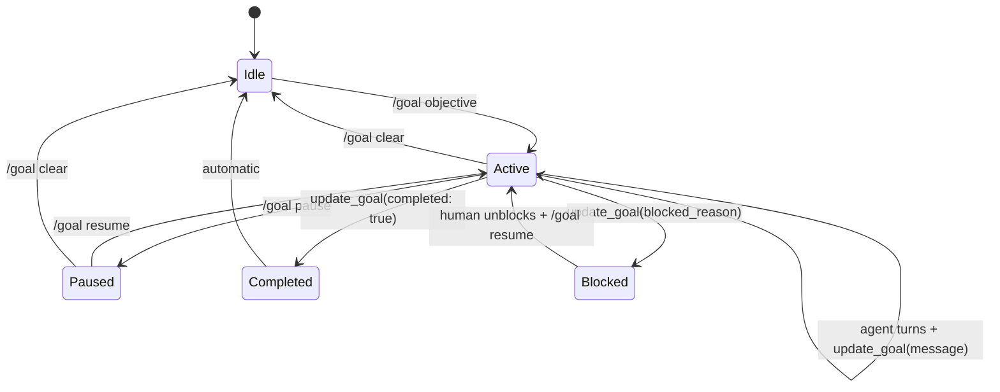

# Grok Build Goal API Reference

Canonical reference for the `/goal` slash command and the `update_goal` agent tool.

## `/goal` Slash Command

Set, manage, or check an autonomous goal. Grok works toward the objective across turns and reports progress.

### Syntax

```
/goal <objective>
/goal status
/goal pause
/goal resume
/goal clear
```

### Arguments

| Argument | Description |
|----------|-------------|
| `<objective>` | Natural-language goal. Include verifiable done conditions when possible. |
| `status` | Show current goal state, recent progress, and whether goal mode is active. |
| `pause` | Pause goal mode without clearing the objective. |
| `resume` | Resume a paused goal. |
| `clear` | Exit goal mode and clear the active objective. |

### Examples

```
/goal Migrate the auth module to the new API. Done when all auth tests pass and no imports from legacy/auth remain.
/goal status
/goal pause
/goal resume
/goal clear
```

### Availability

`/goal` appears in the command list only when:

1. The goal feature is enabled for your session, and
2. The `update_goal` tool is in the session toolset.

## `update_goal` Tool

The agent calls this tool to report progress without flooding the conversation. Humans typically use `/goal status`; the agent uses `update_goal`.

### Parameters

| Parameter | Type | Description |
|-----------|------|-------------|
| `message` | string (optional) | Short progress log. Visible in tool output, not surfaced to the pager dashboard. |
| `completed` | boolean (optional) | Set `true` **only** when the goal is fully achieved. Ends goal mode. Use with `message` for a completion summary. |
| `blocked_reason` | string (optional) | Set when truly stuck after 3+ consecutive failed attempts at the same problem. Pauses the goal as blocked. Never use for success. |

### Examples (agent-side)

**Progress update:**

```json
{ "message": "Migrated token refresh; 12/18 auth tests passing" }
```

**Completion:**

```json
{ "completed": true, "message": "All auth tests pass; legacy imports removed" }
```

**Blocked:**

```json
{ "blocked_reason": "OAuth provider sandbox credentials expired; need human to rotate secrets" }
```

### Rules of Thumb

1. Call `update_goal` at meaningful milestones — not every tool call.
2. Use `completed: true` only when the **verifier** agrees (tests, checklist, separate sub-agent).
3. Use `blocked_reason` sparingly — after genuine exhaustion of alternatives, not on first error.
4. Never put success text in `blocked_reason`.

## Goal Mode Lifecycle



## Related Commands

| Command | Relationship |
|---------|--------------|
| `/loop` | Scheduled recurring work — often **feeds** goals |
| `scheduler_create` | Durable scheduling; pair with loops, not goals |
| `Task` (subagents) | Launch verifier in worktree isolation |
| Skills | Encode scoping, verification, and completion checks |

## External State Convention

Recommended project files when using goals:

| File | Purpose |
|------|---------|
| `GOAL.md` | Active objective, done condition, progress log, blockers |
| `AGENTS.md` | Project rules including "always verify before `completed: true`" |
| `.grok/skills/goal-verifier/` | Skill that checks done conditions independently (Grok Build) |
| `.opencode/skills/goal-verifier/` | Skill that checks done conditions independently (OpenCode) |

See [starters/minimal-goal/](../starters/minimal-goal/) and [templates/GOAL.md.template](../templates/GOAL.md.template).