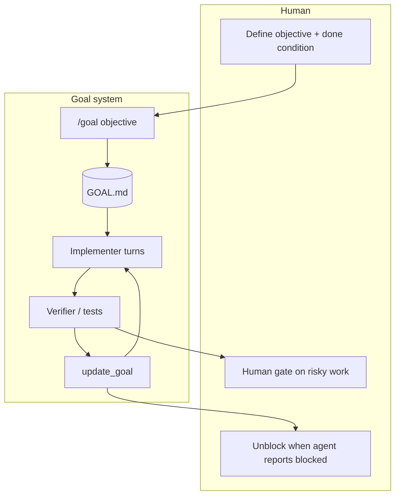

# Concepts & Vocabulary

Goal engineering sits between one-shot prompting and long-running loops. This glossary links the ideas so you can design goals with the right mental model.

## Goal Engineering

**Replacing "try once" with "run until verifiably done."** You define an objective and a completion condition; Grok Build persists across turns, reports progress via `update_goal`, and exits goal mode when done or blocked.

A goal is a **bounded objective** — not an open-ended chat, not a cron job.

## Related Concepts

### Loop Engineering

[Loop engineering](https://github.com/cobusgreyling/loop-engineering) schedules recurring discovery and triage. Goals **finish** items that loops surface.

```
Loop  = when to look + what to prioritize
Goal  = how to complete one item end-to-end
```

### Harness Engineering

The environment one agent run executes in: tools, permissions, skills. A goal is **harness + persistence + verifier + done condition**.

### Intent Debt

Without a written objective, each turn re-derives what you wanted. `GOAL.md` and `/goal` pay down intent debt for multi-turn work.

### Comprehension Debt

Goals ship code faster than you can read it. Require verifier gates and human review on high-risk paths.

### Maker / Checker Split

The implementer must never mark its own homework done. Use a verifier skill, test suite, or sub-agent before `update_goal(completed: true)`.

## The Four Primitives

See [primitives.md](./primitives.md).

1. **Objective** — one sentence + measurable done condition
2. **Verifier** — independent completion check
3. **State** — `GOAL.md` or equivalent
4. **Budget** — turn/token caps and kill switches

## Concept Map



## When to Use a Goal

| Use a goal when… | Use something else when… |
|------------------|--------------------------|
| Task has a clear end state | Work is exploratory / undefined → Plan mode |
| You can verify "done" objectively | You need recurring triage → `/loop` |
| Multi-turn persistence helps | Single Q&A suffices → normal prompt |
| You want progress without chat noise | You need fleet governance → [fleet-engineering](https://github.com/cobusgreyling/fleet-engineering) |